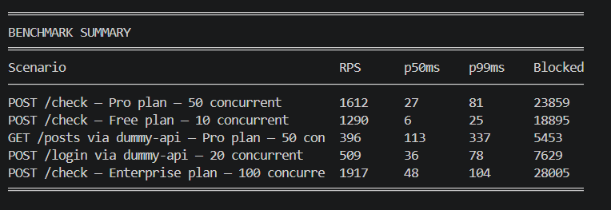

## Rate Limiting Microservice — Built to Scale Horizontally

A distributed rate limiting microservice built with Node.js, TypeScript, and Redis. Implements sliding window algorithm using Redis Sorted Sets and Lua scripting for atomicity.

---

## Services

| Service | Container Port | Host Port | Description |
|---------|----------------|-----------|-------------|
| rate-limiter-service | 3001 | 3101 | Core microservice — enforces rate limits |
| dummy-api-service | 3002 | 3102 | Consumer service + simulator homepage |

Production URLs when deployed behind Nginx:

- `https://ratelimiter.itsatul.tech/` → simulator homepage
- `https://ratelimiter.itsatul.tech/health` → rate limiter health proxy

---

## How it works

Every request to `dummy-api-service` first calls `POST /check` on the rate limiter. The rate limiter runs a Lua script atomically in Redis — removes expired timestamps, counts active ones, allows or blocks. Result is returned with rate limit headers.

## Architecture


---

## Algorithm — Sliding Window

Each request is stored as a timestamp in a Redis Sorted Set (ZSET). On every new request, three steps run atomically via Lua:

1. `ZREMRANGEBYSCORE` — remove timestamps outside the current window
2. `ZCARD` — count remaining requests
3. `ZADD` — add current timestamp if allowed

Redis key format: `ratelimit:{userId}:{route}`

---

## Rate Limit Plans

| Plan | Default Limit | Window |
|------|--------------|--------|
| free | 100 requests | 15 min |
| pro | 1000 requests | 15 min |
| enterprise | 10000 requests | 15 min |

Route-specific limits override plan limits:

| Route | Limit | Window |
|-------|-------|--------|
| POST /login | 5 requests | 60 sec |
| GET /posts | 200 requests | 60 sec |
| GET /profile | 50 requests | 60 sec |

---

## Running

### With Docker (recommended)

```bash
git clone https://github.com/atulkr20/Rate-Limiter.git
cd Rate-Limiter
docker compose up --build
```

After the stack starts, use `http://localhost:3101` for the rate limiter and `http://localhost:3102` for the dummy API from your host machine.

To build and push the deployable images:

```bash
docker compose build
docker compose push
```

On the Droplet, the deployed compose stack should include both `rate-limiter-service` and `dummy-api-service`, and Nginx should proxy `ratelimiter.itsatul.tech` to `http://127.0.0.1:3102`.

---

## Environment Variables

**rate-limiter-service**

| Variable | Default | Description |
|----------|---------|-------------|
| PORT | 3001 | Container port |
| REDIS_URL | redis://localhost:6379 | Redis connection |
| FAILOVER_MODE | open | `open` or `closed` |
| LOG_LEVEL | info | Pino log level |

**dummy-api-service**

| Variable | Default | Description |
|----------|---------|-------------|
| PORT | 3002 | Container port |
| RATE_LIMITER_URL | http://rate-limiter-service:3001 | Rate limiter URL inside Docker |

The simulator page auto-detects its API origin in production, so you do not need to manually edit the API URL after deployment.

---

## Failover Strategy

Configured via `FAILOVER_MODE` env variable.

- `open` — Redis down → allow all requests. Use for non-critical endpoints where availability matters more than strict enforcement.
- `closed` — Redis down → block all requests. Use for sensitive endpoints like OTP or payments where enforcement cannot be relaxed.

---

## Tech Stack

- **Node.js + TypeScript** — service runtime
- **Express** — HTTP server
- **ioredis** — Redis client
- **Lua scripting** — atomic sliding window operations
- **Pino** — structured JSON logging
- **Docker + docker-compose** — containerized deployment

---

## Benchmark



This is a localhost Docker benchmark, not a production deployment but it stress-tests the core logic under real concurrency pressure

Machine: Intel i5, 8GB RAM, Windows 11, Docker Desktop (local)

